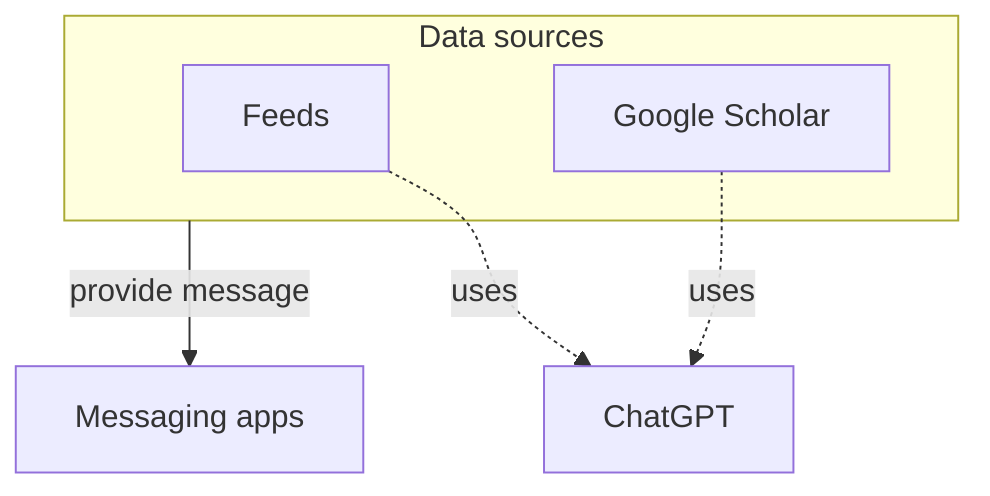

# paperboy
<p align="center">
    
</p>

*A faithful deliverer to help watching new arrivals in messaging apps.*

# paperboy is designed to...
1. **Fetch** new arrivals from *data sources*
2. **Summarize** it by `ChatGPT` API
3. **Post** the summary to *massaging apps*



<p align="center">
    
</p>


### Data souces
The followings are supported for now
1. `Feeds` - e.g. [GitHub Blog](https://github.blog/feed/), [Spotify Engineering](https://engineering.atspotify.com/feed/), etc..
2. `Google Scholar` - i.e. https://scholar.google.com/

### Messaging apps
Only the `Discord` is supported for now.

# Prerequisites
- Python 3.12+ (may work on older, but not assured)
- Open AI Account & API Key
- Discord Account

### *CAUTION!!*
**[You may be charged by OpenAI](https://openai.com/pricing) if you use ChatGPT API** through this tool.  
**We do not take any responsibility for any damage or loss caused through this tool.**

For instance, if there is a new arrival on a feed you watching, ***paperboy* will pass entire the web page text to ChatGPT API**. The cost depends on the amount of the text in the page but we can't manage it.  

Also remember that if you watch more data souces, you may be charged more.   
Please be sure to **handle the cost by yourself**. 

*NOTE: Setting [soft/hard limit](https://community.openai.com/t/how-to-set-a-price-limit/13086) will be great help to manage your budget.*

# Preparation
## 1. Install python libraries
```
pip install -r requirements.txt
```

## 2. Create discord app
Let's try with [the document](https://gist.github.com/t407o/ab8d7874350bd4c60bad8522196f185b)!
Don't forget to note the `Bot Token` and `Channel Id`.

## 3. Set environment variables
| Environment Variable | Description |
|----------------------|-------------|
|`OPENAI_API_KEY`       |Your OpenAI API key.|
|`DISCORD_BOT_TOKEN`    |Your Discord bot token.|
|`DISCORD_CHANNEL_ID`   |The channel ID to post the paper.|
|`DISCORD_NOTIFIEE`   |_(Optional)_ The user name to be notified on finish (if one new arrival is there).|

If you are working with devcontainer(VSCode plugin), `.env` file will be loaded when you start the container

## 4. Set configurations
*paperboy* will refer the configurations in `config` directory.  

Basically, you have to create `config` directory by yourself, refering [samples](https://github.com/t407o/paperboy/tree/main/config_samples) or [the docs](https://github.com/t407o/paperboy/tree/main#extentions).   
*If you run without `config` dir*, the directory will be generated from [`config_sample`](https://github.com/t407o/paperboy/tree/main/config_samples) directory.

# Run locally
```
python main.py
```

*By default*, 
- only **feeds** will be refered as a data source
- ChatGPT's `gpt-3.5-turbo-16k` model will be used to summarize texts


# Extentions
The extentions are effectively the implementation of the data sources.  
By enabling the extentions, you can watching new arrivals from different data sources.

The extentions will be enabled by specifing by `-e` option.
```
python main.py -e google_scholar
```

| Extention | Description |
|----------|-------------|
|[feeds](https://github.com/t407o/paperboy/tree/main/extentions/feeds)|Get new articles from specified feeds. **If `-e` option is omitted, this extention will be enabled automatically.**|
|[google_scholar](https://github.com/t407o/paperboy/tree/main/extentions/google_scholar)|Get new papers from Google Scholar by searching by keywords|

See the *README.md* files for each extentions for more details.
